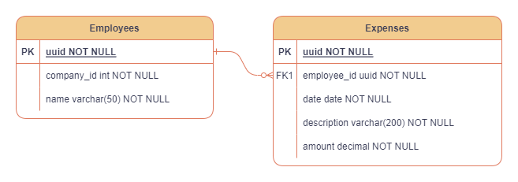

## :chart_with_upwards_trend: Expense Tracker

This backend for the expense tracker is developed using Express.js, with Prisma as the ORM for efficient database management. PostgreSQL is the chosen database, Jest for testing, and Docker to enhance the development workflow.

> Check the [documentation](https://osm-expense-tracker-f0320512353f.herokuapp.com/api-docs/) for proper use

## :toolbox: Tools required

- Docker :whale2:;
- You might also consider using [Postman](https://www.postman.com/downloads/), [Insomnia](https://insomnia.rest/download) to send API requests, it can also be done through the documentation link.

## 📋 Instalation guide

- Clone this repo;
- Check the env template file for setting up the proper variables;
- On the root folder execute `docker compose up`;
- Once the container is up and running, the configured port is 5000, check it running on `http://localhost:5000/api-doc/`
- Send requests `to http://localhost:5000/***` based on the [docs](https://osm-expense-tracker-f0320512353f.herokuapp.com/api-docs/).
- The project includes a docker-compose.test.yml file for setting up tests. Running the command docker compose -f docker-compose.test.yml builds a container with a fresh PostgreSQL database and executes migrations to establish a testing environment.
- On another terminal window you can run the test by `npm run test`

## 💻 Tech stack

      
  
## ER Diagram

## 🔗 Links

- App frontend [repo](https://expense-tracker-osm.vercel.app/);
- Deployed [app](https://mshop-ecommerce.vercel.app/).
